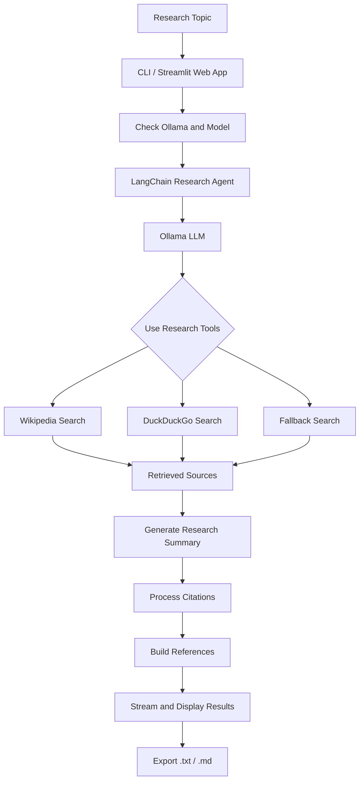

# 🔎 ResearchAgentPy

**A local AI-powered research agent built with Python, LangChain, and Ollama.**

ResearchAgentPy is an AI research assistant that automatically searches the web, collects information from multiple sources, and generates structured research summaries with inline citations and references.

Powered by **Ollama**, it runs language models locally without requiring paid LLM APIs.

Use it through a command-line interface or an interactive Streamlit web application. Research results can be streamed in real time and exported as Markdown or text files.

---

## 🚀 Features

* 🔍 **Web Research:** Search Wikipedia and DuckDuckGo for relevant information.
* 📚 **Source-Based Citations:** Generate numbered inline citations using retrieved sources.
* 📑 **Automatic References:** Create a numbered reference list with source URLs.
* ⚡ **Live Streaming:** View research progress and generated content in real time.
* 🤖 **Local AI:** Run language models locally using Ollama.
* 🛡️ **Fallback Search:** Perform direct searches when the agent fails to use its research tools successfully.
* 🌐 **Multilingual Output:** Generate research summaries in different languages.
* 📏 **Customizable Length:** Choose between short, medium, and long summaries.
* 📦 **Batch Research:** Process multiple research topics from a text file.
* 💻 **CLI Interface:** Run research tasks directly from the terminal.
* 🌐 **Streamlit Web App:** Access an interactive browser-based interface.
* 📥 **Export Options:** Save research results as `.txt` or `.md` files.
* 🕘 **Research History:** Access previously generated research.
* 🩺 **Health Checks:** Check Ollama connectivity and model availability.
* 🧪 **Automated Testing:** Run unit tests and GitHub Actions CI workflows.

---

## 🛠️ Tech Stack

| Technology     | Purpose                                  |
| -------------- | ---------------------------------------- |
| Python 3.10+   | Core programming language                |
| Ollama         | Local LLM inference                      |
| LangChain      | Agent orchestration and tool integration |
| Streamlit      | Interactive web interface                |
| Wikipedia      | Research and information retrieval       |
| DuckDuckGo     | Web search                               |
| Pytest         | Automated testing                        |
| GitHub Actions | Continuous integration                   |

---

## 🧠 How It Works

The research agent follows a structured workflow to collect information and generate research summaries.



### Workflow

1. **Topic Input:** Enter a research topic through the CLI or Streamlit application.
2. **Health Check:** Verify Ollama connectivity and model availability.
3. **Agent Execution:** The LangChain agent processes the research request using the configured Ollama model.
4. **Information Retrieval:** Search Wikipedia and DuckDuckGo through the available research tools.
5. **Fallback Search:** Perform direct searches if the agent fails to retrieve information through its tools.
6. **Summary Generation:** Generate a research summary using the collected information.
7. **Citation Processing:** Associate citations with retrieved sources and prepare a numbered reference list.
8. **Live Streaming:** Display generated content and research progress.
9. **Export:** Save the completed research as a `.txt` or `.md` file.

### 📚 Citation System

The application maintains a list of retrieved sources and uses them to generate numbered citations in the research output.

**Example:**

```text
Quantum computing uses quantum-mechanical
properties such as superposition and entanglement [1].

References:

1. Quantum computing - Wikipedia
   https://en.wikipedia.org/wiki/Quantum_computing
```

Citation numbers are associated with sources retrieved by the application rather than being generated as arbitrary reference URLs.

> **Note:** Citations indicate the sources used during research. They do not guarantee that every generated claim is accurate or directly supported by the cited source. Always verify important information against the original references.

---

## 📂 Project Structure

```text
ResearchAgentPy/
│
├── research_agent/
│   ├── agent.py
│   ├── tools.py
│   ├── citations.py
│   ├── storage.py
│   ├── health.py
│   ├── config.py
│   ├── cli.py
│   └── web.py
│
├── tests/
│   ├── conftest.py
│   ├── test_agent_stream.py
│   ├── test_citations.py
│   ├── test_cli.py
│   ├── test_health.py
│   ├── test_storage.py
│   └── test_tools.py
│
├── outputs/
│   └── .gitkeep
│
├── .github/
│   └── workflows/
│       └── ci.yml
│
├── app.py
├── main.py
├── pyproject.toml
├── requirements.txt
├── .env.example
├── .gitignore
├── LICENSE
└── README.md
```

### Key Components

| File / Directory              | Description                                  |
| ----------------------------- | -------------------------------------------- |
| `research_agent/agent.py`     | Core research agent and generation workflow  |
| `research_agent/tools.py`     | Search and research tools                    |
| `research_agent/citations.py` | Citation processing and reference generation |
| `research_agent/storage.py`   | Research result storage and history          |
| `research_agent/health.py`    | Ollama and model health checks               |
| `research_agent/config.py`    | Application configuration                    |
| `research_agent/cli.py`       | Command-line interface                       |
| `research_agent/web.py`       | Web-related application functionality        |
| `app.py`                      | Streamlit application entry point            |
| `main.py`                     | Additional application entry point           |
| `tests/`                      | Automated unit tests                         |
| `.github/workflows/ci.yml`    | GitHub Actions CI configuration              |
| `outputs/`                    | Directory for generated research files       |
| `pyproject.toml`              | Python project and package configuration     |
| `requirements.txt`            | Python dependencies                          |
| `.env.example`                | Example environment configuration            |

---

## ⚙️ Requirements

Before installing the project, ensure the following are available:

* **Python:** 3.10 or newer
* **Ollama:** Installed and running
* **Ollama Model:** A model compatible with the agent's tool-calling configuration
* **Internet Connection:** Required for Wikipedia and DuckDuckGo research

Download Ollama from its official website:

https://ollama.com/

---

## 📥 Installation

### 1. Clone the Repository

```bash
git clone https://github.com/goutam-vg/Research_oO.git
cd Research_oO
```

### 2. Create a Virtual Environment

A virtual environment keeps project dependencies isolated.

**Windows (PowerShell):**

```powershell
python -m venv .venv
.venv\Scripts\Activate.ps1
```

**Linux / macOS:**

```bash
python3 -m venv .venv
source .venv/bin/activate
```

### 3. Install Dependencies

Install the required Python packages:

```bash
pip install -r requirements.txt
```

### 4. Configure Environment Variables

Create a local `.env` file using the provided example.

**Windows:**

```powershell
Copy-Item .env.example .env
```

**Linux / macOS:**

```bash
cp .env.example .env
```

Update the environment variables if necessary.

### 5. Install an Ollama Model

For example, download Qwen3 8B:

```bash
ollama pull qwen3:8b
```

Make sure Ollama is running and the selected model is available before launching the application.

---

## 💻 CLI Usage

The command-line interface allows you to perform research directly from your terminal.

### Basic Usage

```bash
python -m research_agent "Quantum computing"
```

You can also install the package in editable mode:

```bash
pip install -e .
```

After installation, use the `research-agent` command:

```bash
research-agent "Quantum computing"
```

### Examples

**1. Basic Research**

```bash
research-agent "Quantum computing"
```

**2. Generate a Long Summary**

```bash
research-agent "Black holes" --length long
```

**3. Export Results as Markdown**

```bash
research-agent "Black holes" --format md
```

**4. Generate Research in Another Language**

```bash
research-agent "Climate change" --lang Spanish
```

**5. Research Multiple Topics**

Create a text file named `topics.txt`:

```text
Quantum computing
Artificial intelligence
Renewable energy
Black holes
```

Run batch research:

```bash
research-agent --file topics.txt
```

---

## 🌐 Streamlit Web Application

The project also includes an interactive web interface built with Streamlit.

### Launch the Application

```bash
streamlit run app.py
```

Open the local URL displayed in your terminal to access the application.

### Web App Features

* **Model Selection:** Choose the Ollama model for research.
* **Research Length:** Select short, medium, or long summaries.
* **Language Selection:** Generate output in your preferred language.
* **Topic Input:** Enter the subject you want to research.
* **Live Output:** Follow research progress and generated content.
* **Research History:** Access previously generated research.
* **Download Results:** Export summaries as `.txt` or `.md` files.

---

## 📋 CLI Options

The following table describes the command-line options exposed by the application.

| Option               | Default                            | Description                                  |
| -------------------- | ---------------------------------- | -------------------------------------------- |
| `topic`              | Required for single-topic research | Research topic                               |
| `-f`, `--file`       | None                               | Text file containing multiple topics         |
| `-m`, `--model`      | `OLLAMA_MODEL`                     | Ollama model to use                          |
| `-l`, `--length`     | `medium`                           | Summary length: `short`, `medium`, or `long` |
| `--lang`             | `English`                          | Output language                              |
| `--format`           | `txt`                              | Output format: `txt` or `md`                 |
| `-o`, `--output-dir` | `outputs`                          | Directory for generated files                |

**Note:** The defaults and option behavior should match the argument definitions in `research_agent/cli.py`.

---

## 🔧 Configuration

The application uses environment variables for model selection and runtime configuration.

Create a `.env` file based on `.env.example`.

### Environment Variables

| Variable             | Default                  | Description                                     |
| -------------------- | ------------------------ | ----------------------------------------------- |
| `OLLAMA_MODEL`       | `qwen3:8b`               | Default Ollama model                            |
| `OLLAMA_BASE_URL`    | `http://localhost:11434` | Ollama server address                           |
| `OLLAMA_KEEP_ALIVE`  | `30m`                    | Duration the model stays loaded                 |
| `OLLAMA_REASONING`   | `false`                  | Enable or disable model reasoning, if supported |
| `OLLAMA_NUM_PREDICT` | Per length               | Maximum number of generated tokens              |

### Summary Token Limits

The application uses different token limits depending on the selected research length.

| Length | Maximum Tokens |
| ------ | -------------: |
| Short  |            500 |
| Medium |           1000 |
| Long   |           1800 |

These values control generation length and do not guarantee a particular word count.

---

## 🧪 Testing

The project includes automated unit tests for core functionality.

The tests are designed to run without requiring a live Ollama server or network access, using test fixtures and mocks where appropriate.

### Run the Test Suite

```bash
python -m pytest
```

### Continuous Integration

The repository includes a GitHub Actions workflow for automated testing.

The configured CI workflow runs tests using:

* Python 3.10
* Python 3.12

This helps verify compatibility across the configured Python versions.

---

## 🛠️ Troubleshooting

### 1. Ollama Cannot Be Reached

Make sure Ollama is running.

```bash
ollama serve
```

If Ollama is already running as a background service, you may not need to execute this command.

Check the installed models:

```bash
ollama list
```

### 2. Model Is Not Installed

Download the required model:

```bash
ollama pull qwen3:8b
```

Ensure the configured model name matches an installed model.

### 3. First Response Is Slow

The first response may take longer because Ollama needs to load the model into memory.

The `OLLAMA_KEEP_ALIVE` setting controls how long the model remains loaded after use.

### 4. No References Are Generated

Check the availability of the research sources.

If Wikipedia and DuckDuckGo are unreachable, the agent may not have enough retrieved information to generate references.

### 5. Weak Research Results

Research quality depends on the selected model, available sources, retrieved information, and generation settings.

Consider trying a larger or more capable Ollama model if your hardware can support it.

### 6. Python Dependency Errors

Ensure the virtual environment is activated and install the dependencies again:

```bash
pip install -r requirements.txt
```

If problems persist, verify that the active Python version meets the project's requirements.

---

## 🔮 Roadmap

Potential future improvements include:

* [ ] Follow-up questions about previously generated research
* [ ] PDF export
* [ ] Deeper webpage-reading and information extraction
* [ ] Docker support
* [ ] Additional research sources
* [ ] Improved multi-step research workflows

These are planned enhancements and are not necessarily available in the current implementation.

---

## 🙏 Acknowledgements

This project was inspired by and developed with reference to the educational content and tutorials of **Tech With Tim**.

Special thanks to **Tim Ruscica (Tech With Tim)** for his tutorials and practical guidance on Python, AI agents, and AI-powered applications.

This repository contains my own implementation, modifications, and extensions developed through that learning process.

Explore more of his work:

[Tech With Tim — YouTube](https://www.youtube.com/@TechWithTim)

---

## 📄 License

This project is licensed under the **MIT License**.

See the [LICENSE](https://github.com/goutam-vg/Research_oO/blob/main/LICENSE) file for details.

---

## 👨‍💻 Author

**Goutam VG**

A local AI research agent built using Python, LangChain, and Ollama.

**GitHub:** [@goutam-vg](https://github.com/goutam-vg)

**Repository:** [Research_oO](https://github.com/goutam-vg/Research_oO)

---


